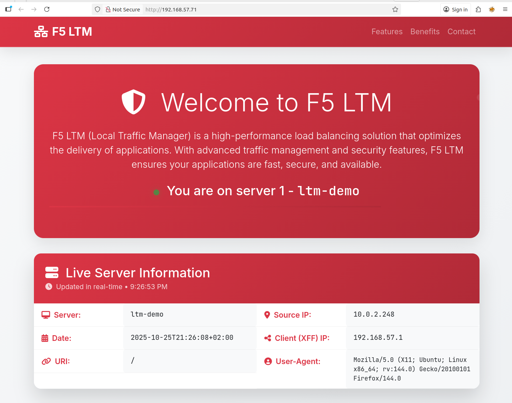
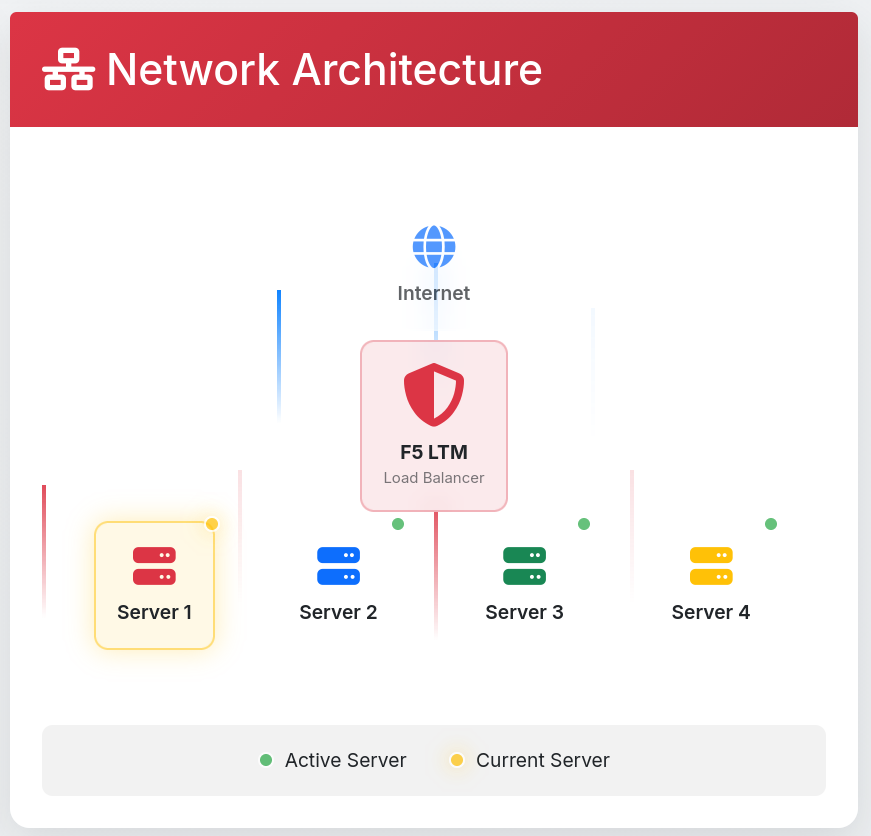
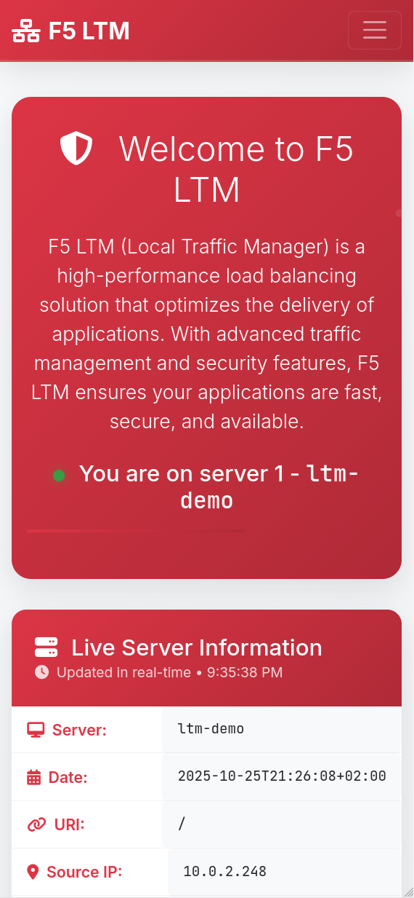

# F5 LTM Demo Environment

A modern, responsive web application designed for demonstrating F5 Local Traffic Manager (LTM) load balancing functionality. This project provides a visually appealing interface that displays real-time server information, making it ideal for testing and showcasing load balancer configurations.

    

## 🌟 Features

- **Real-time Server Information Display**
  - Server hostname
  - Request timestamp (ISO 8601 format)
  - Request URI
  - Source IP address
  - X-Forwarded-For (XFF) header
  - User-Agent information

- **Interactive Network Architecture Diagram**
  - Animated traffic flow visualization
  - Live server status indicators
  - Visual representation of load balancer distribution
  - Current server highlighting

- **Modern UI/UX**
  - Responsive Bootstrap 5.3 design
  - Smooth animations and transitions
  - Mobile-friendly layout
  - Custom gradient themes
  - Font Awesome icons

- **Customizable Gallery Section**
  - Display custom images or screenshots
  - Side-by-side image layout
  - Hover effects and transitions

## 📸 Screenshots

### Dashboard Overview


### Network Architecture


### Mobile Responsive


## 🚀 Quick Start

### Prerequisites

- Web server (NGINX, Apache, or similar)
- Basic knowledge of web server configuration

### Add Multiple IP Addresses on Debian Linux

#### For Debian 11+ (using systemd-networkd or NetworkManager)

Edit `/etc/network/interfaces`:
```bash
sudo nano /etc/network/interfaces
```

Add the following:
```
allow-hotplug eth0
iface eth0 inet static
address 192.168.1.10/24
gateway 192.168.1.1

auto eth0:1
allow-hotplug eth0:1
iface eth0:1 inet static
address 192.168.1.11/24

auto eth0:2
allow-hotplug eth0:2
iface eth0:2 inet static
address 192.168.1.12/24

auto eth0:3
allow-hotplug eth0:3
iface eth0:3 inet static
address 192.168.1.13/24
```

Restart networking:
```bash
sudo systemctl restart networking
```

**Note:** Replace `eth0` with your actual interface name.

### Generate SSL Certificate

Create a self-signed SSL certificate with RSA 2048-bit key (no password):
```bash
openssl req -x509 -nodes -days 365 -newkey rsa:2048 \
  -keyout nginx-selfsigned.key -out nginx-selfsigned.crt \
  -subj "/C=US/ST=State/L=City/O=Organization/CN=example.com"
```

**Parameters:**
- `-x509` - Output a self-signed certificate
- `-nodes` - No DES (no password on private key)
- `-days 365` - Certificate valid for 1 year
- `-newkey rsa:2048` - Generate new RSA key with 2048 bits
- `-keyout` - Output file for private key
- `-out` - Output file for certificate
- `-subj` - Certificate subject (customize as needed)

**Output files:**
- `private.key` - Private key (no password)
- `certificate.crt` - Self-signed certificate

### Installation

1. **Clone the repository**
   ```bash
   git clone https://github.com/webserverdude/ltm-demo-html.git
   cd webpages
   ```
2. **Deploy to your web server**
   ```bash
   # Example for NGINX
   sudo cp -r * /var/www/ltm-demo-html
   ```

3. **Configure your web server** (see NGINX configuration below)

## ⚙️ NGINX Configuration

### Basic Setup with Variable Substitution

The configuration includes HTTP as well as HTTPS listeners.
Add this configuration to your NGINX server block:

```
server {
        listen 192.168.1.10:8000 default_server;
        root /var/www/ltm-demo-html;

        index index_red.html;

        server_name _;

        add_header X-Backend-Server 1;
        add_header Set-Cookie "X-Backend-Server=1; Max-Age=10";

        location / {
                try_files $uri $uri/ =404;
        }

        # Enable the substitution filter
        sub_filter_once off;  # Allow multiple substitutions

        # Replace template variables with actual NGINX variables
        sub_filter '{{server_name}}' '$hostname';
        sub_filter '{{time_iso8601}}' '$time_iso8601';
        sub_filter '{{request_uri}}' '$request_uri';
        sub_filter '{{remote_addr}}' '$remote_addr';
        sub_filter '{{http_x_forwarded_for}}' '$http_x_forwarded_for';
        sub_filter '{{http_user_agent}}' '$http_user_agent';
}
server {
        listen 10.0.2.71:443 ssl default_server;
        ssl_certificate /etc/ssl/certs/nginx-selfsigned.crt;
        ssl_certificate_key /etc/ssl/private/nginx-selfsigned.key;

        # SSL configuration
        ssl_protocols TLSv1.2 TLSv1.3;
        ssl_ciphers ECDHE-RSA-AES128-GCM-SHA256:ECDHE-RSA-AES256-GCM-SHA384:ECDHE-RSA-AES128-SHA256:ECDHE-RSA-AES256-SHA384;
        ssl_prefer_server_ciphers off;
        ssl_session_cache shared:SSL:10m;
        ssl_session_timeout 10m;

        root /var/www/ltm-demo-html;
        index index_red.html;
        server_name _;
        add_header X-Backend-Server 1;
        add_header Set-Cookie "X-Backend-Server=$request_id; Max-Age=10; Secure; SameSite=Strict";
        location / {
                try_files $uri $uri/ =404;
        }
        # Enable the substitution filter
        sub_filter_once off;  # Allow multiple substitutions

        # Replace template variables with actual NGINX variables
        sub_filter '{{server_name}}' '$hostname';
        sub_filter '{{time_iso8601}}' '$time_iso8601';
        sub_filter '{{request_uri}}' '$request_uri';
        sub_filter '{{remote_addr}}' '$remote_addr';
        sub_filter '{{http_x_forwarded_for}}' '$http_x_forwarded_for';
        sub_filter '{{http_user_agent}}' '$http_user_agent';
}
```

**Note:** This is just a snippet for one HTTP and one HTTPS virtual. The full config is in `/nginx_config/`.


## 📁 Project Structure

```
webpages/
├── index_red.html            # Server 1 (Red theme)
├── index_blue.html           # Server 2 (Blue theme)
├── index_green.html          # Server 3 (Green theme)
├── index_yellow.html         # Server 4 (Yellow theme)
├── assets/styles_red.css     # CSS for red theme
├── assets/styles_blue.css    # CSS for blue theme
├── assets/styles_green.css   # CSS for green theme
├── assets/styles_yellow.css  # CSS for green theme
├── assets/scripts.js         # JavaScript functionality
├── assets/r12000image1.png   # rSeries image
├── assets/image142.png       # VELOS image
├── nginx_config/ltm-demo     # NGINX config files for http
├── nginx_config/ltm-demo-ssl # NGINX config files for https
├── screenshots/              # Browser screenshots
└── README.md                 # This file
```

## 🔧 Template Variables

The following template variables are automatically replaced by NGINX:

| Variable | NGINX Variable | Description |
|----------|----------------|-------------|
| `{{server_name}}` | `$hostname` | Server hostname |
| `{{time_iso8601}}` | `$time_iso8601` | Current timestamp in ISO 8601 format |
| `{{request_uri}}` | `$request_uri` | Full request URI with arguments |
| `{{remote_addr}}` | `$remote_addr` | Client IP address |
| `{{http_x_forwarded_for}}` | `$http_x_forwarded_for` | X-Forwarded-For header value |
| `{{http_user_agent}}` | `$http_user_agent` | User-Agent header value |

## 📦 Dependencies

All dependencies are loaded via CDN:

- **Bootstrap 5.3.0** - UI framework
- **Font Awesome 6.4.0** - Icons
- **Animate.css 4.1.1** - CSS animations
- **Google Fonts (Inter + JetBrains Mono)** - Typography

## 📝 License

This project is licensed under the MIT License - see the [LICENSE](LICENSE) file for details.

---

**Note:** This is a demo application for testing and development purposes. It is not an official F5 Networks product.